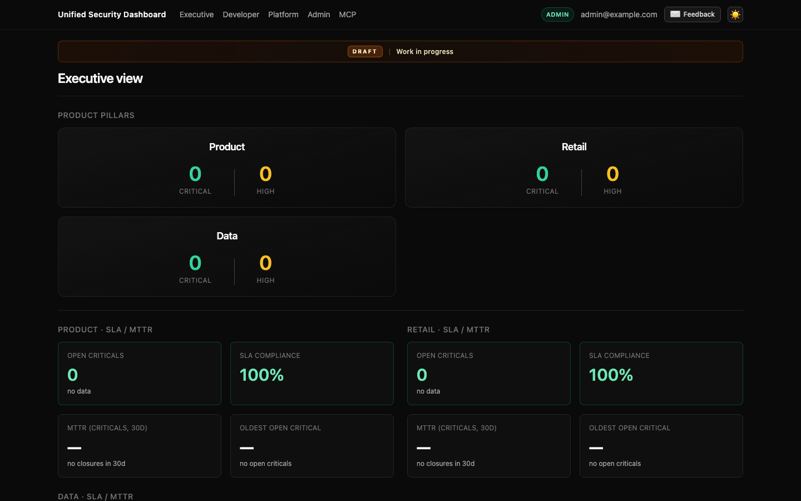
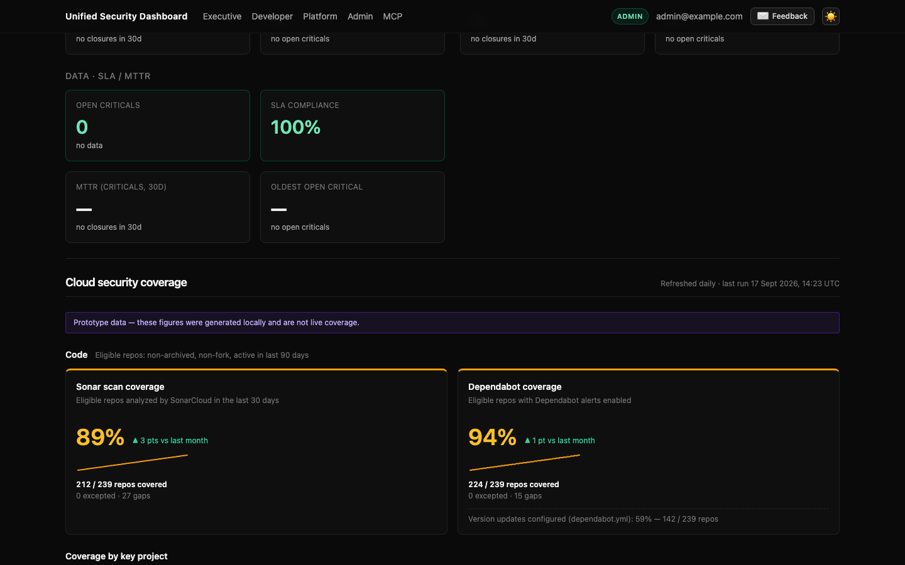
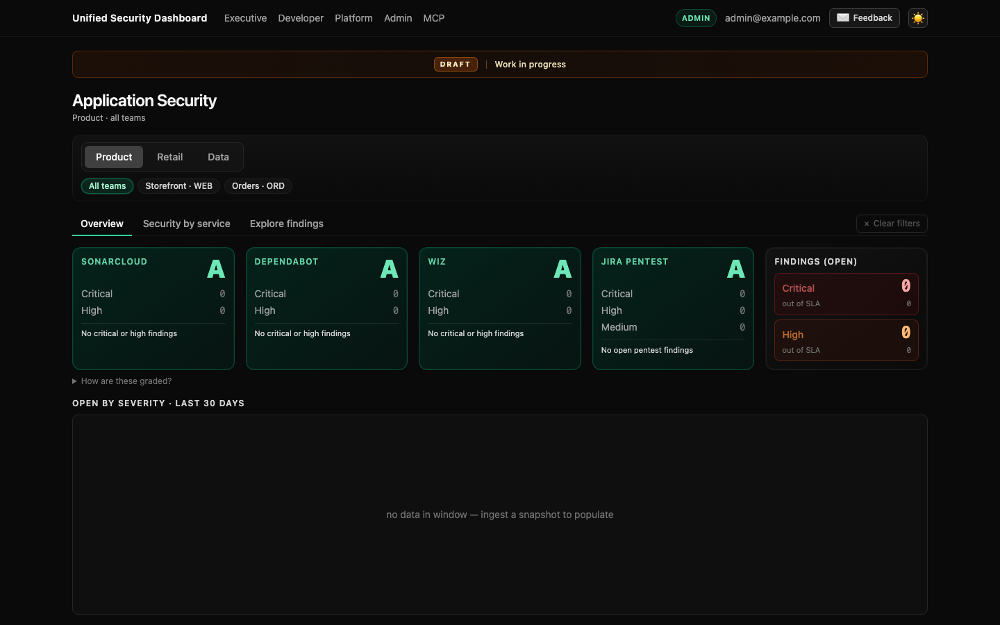
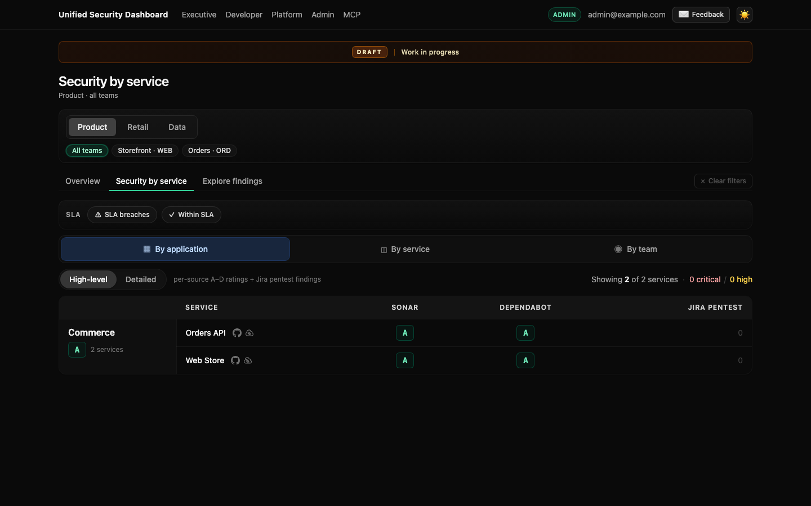
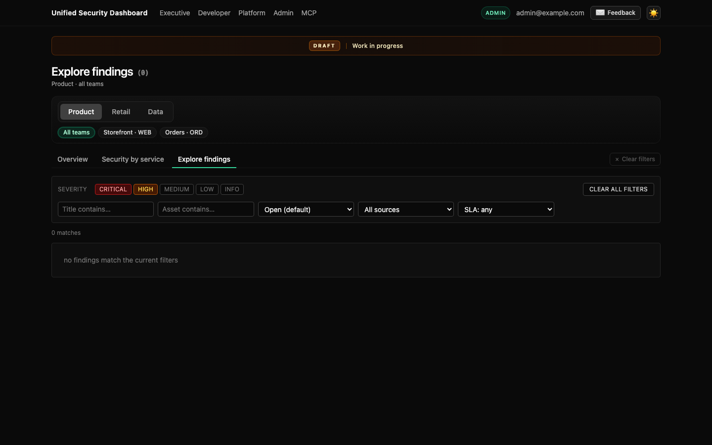
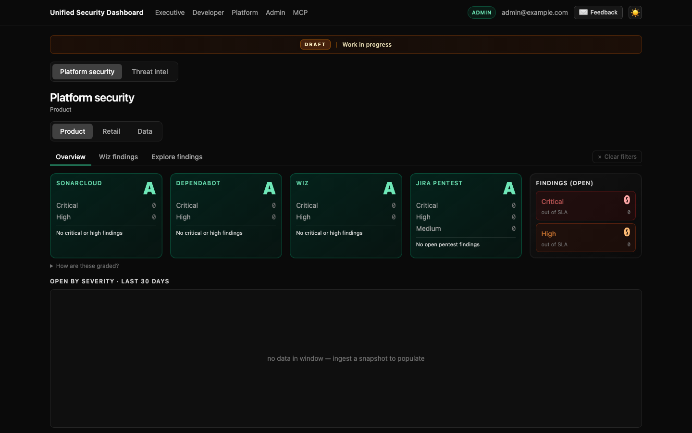
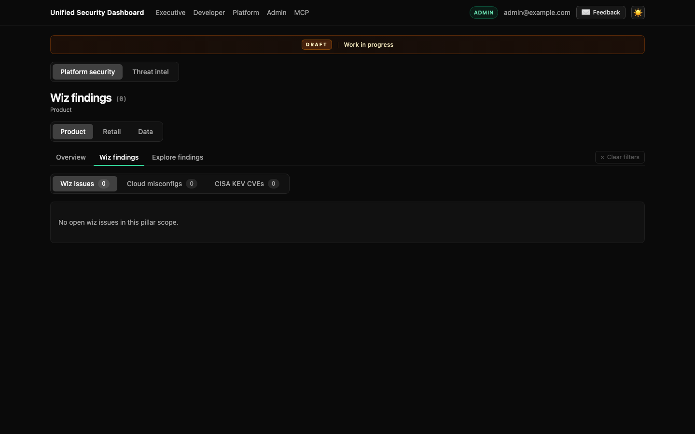
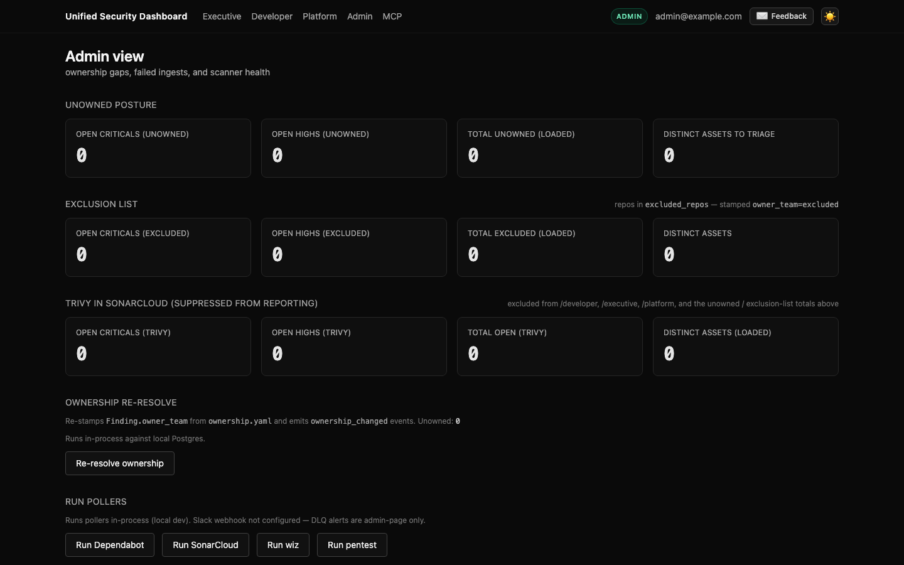
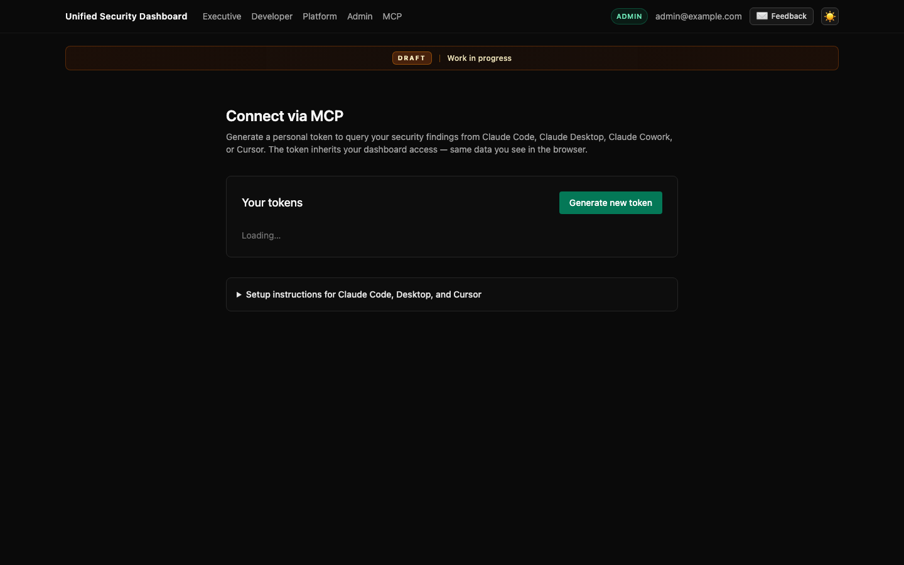

# Frontend

Next.js App Router app in `frontend/`. Server components fetch the FastAPI
API with `serverFetch`. Browser mutations and client tables go through
`/api/proxy/[...path]` so the browser never holds the identity envelope.

Default URL: http://localhost:3000. `API_BASE_URL` points at the API
(`http://localhost:8000` locally).

The screenshots below are from a local run with `DEV_IDENTITY_EMAIL=admin@example.com`.
Finding counts stay at zero until you run a poller. Coverage tiles on Executive
appear after `make coverage-sample`.

## Who sees what

`GET /me` returns `is_admin` from `rbac.yaml`. `/` redirects admins to
`/admin` and everyone else to `/executive`. Header links:

| Path | Audience | Purpose |
|---|---|---|
| `/executive` | all | Pillar KPIs, coverage, drill-down by application/service |
| `/developer` | all | Team-scoped ratings, trend, per-service security, findings |
| `/platform` | all | Platform-pillar posture, Wiz categories, threat intel |
| `/admin` | admins only | Unowned findings, pollers, DLQ, ownership re-resolve, Trivy-in-Sonar |
| `/settings/mcp` | all | Personal MCP tokens and client snippets |

Views are layouts plus query filters (`team`, `source`, `severity`,
`sla_breached`, pillar). They are not separate API roles.

## Executive

Pillar strips and coverage tiles from `component_registry.yaml` /
`component_scope.yaml`. Coverage uses `/coverage` and the policy in
`coverage.yaml`. Sample data: `make coverage-sample`.





## Developer

- `/developer` — ratings and trend (“is this scope healthy?”)
- `/developer/services` — security by service
- `/developer/findings` — finding browser (all sources except admin-only Trivy)
- `/developer/wiz` — Wiz-focused list

`TeamQuickPicker` and the sub-nav keep team/pillar query params across tabs.







## Platform

- `/platform` — overview for the selected platform pillar
- `/platform/findings` — finding browser
- `/platform/wiz` — Wiz by category
- `/platform/threat-intel` — threat-intel pillar shortcut





## Admin

Page-level guard: non-admins do not render `/admin`. The hub is for
attribution gaps (`unowned` teams), scanner health, running pollers, DLQ
events, and ownership re-resolve. SonarCloud-imported Trivy issues stay
here so they do not dilute developer/executive lists.



## MCP settings

Token minting for agents. Client setup is in [user/mcp-server.md](user/mcp-server.md).



## Identity in local UI

`.env.local`:

```bash
DEV_IDENTITY_EMAIL=admin@example.com
DEV_IDENTITY_GROUPS=security@example.com
```

Or `make dev-as-admin` / `make dev-as-member`. Member default is
`developer@example.com`, which is listed on the storefront team in the demo
ownership file but is not an admin.

## Theming and org label

Theme toggle is client-side. Optional `NEXT_PUBLIC_ORGANIZATION_NAME`
overrides the ExampleOrg label on admin copy.
